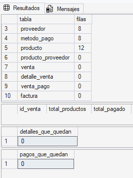
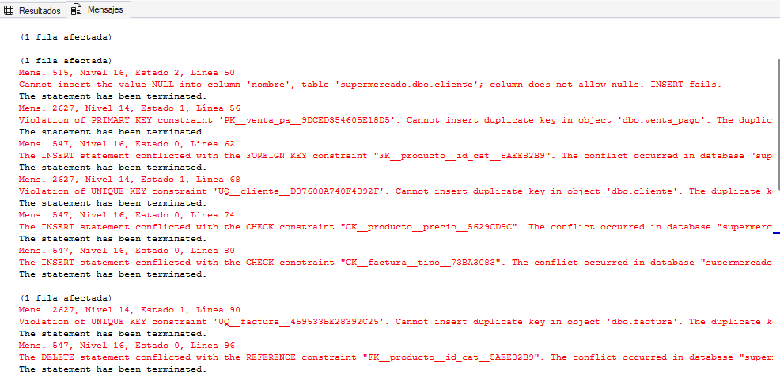

# Etapa III — Implementación

En esta etapa pasamos el modelo relacional de la Etapa II a SQL Server: creamos las tablas (DDL), las cargamos con datos de prueba (DML) y verificamos que las restricciones funcionen.

## Orden de ejecución

| # | Script | Qué hace |
|---|---|---|
| 1 | `sql/ddl/01_tablas_maestras.sql` | Crea la base `supermercado` y las tablas categoria, cliente, proveedor, metodo_pago, producto y producto_proveedor |
| 2 | `sql/ddl/02_tablas_ventas.sql` | Crea venta, detalle_venta, venta_pago y factura |
| 3 | `sql/dml/01_carga_maestras.sql` | Carga categorías, clientes, proveedores, métodos de pago y productos |
| 4 | `sql/dml/02_carga_ventas.sql` | Carga producto_proveedor, ventas, detalles, pagos y facturas |
| 5 | `sql/dml/03_pruebas.sql` | Verifica la carga y prueba las restricciones |

Hay que respetar el orden: una tabla con FK no se puede crear ni cargar antes que la tabla a la que apunta.

## Cómo verificamos la integridad

`03_pruebas.sql` tiene tres partes:

1. **Verificación de la carga:** cuenta las filas de cada tabla y compara, en cada venta, el total de los productos con lo pagado. Los dos montos tienen que coincidir.
2. **Pruebas que deben fallar:** cada una intenta cargar un dato inválido. Si SQL Server devuelve error, la restricción está funcionando.
3. **Prueba de borrado en cascada:** se borra una venta de prueba y se comprueba que también se borraron su detalle y sus pagos.

| Prueba | Qué se intenta hacer | Restricción que lo impide | Error esperado |
|---|---|---|---|
| 3.1 | Cliente sin nombre | NOT NULL | 515 |
| 3.2 | Mismo método de pago dos veces en una venta | PRIMARY KEY compuesta de venta_pago | 2627 |
| 3.3 | Producto con una categoría que no existe | FOREIGN KEY | 547 |
| 3.4 | Cliente con un DNI repetido | UNIQUE | 2627 |
| 3.5 | Producto con precio negativo | CHECK (precio > 0) | 547 |
| 3.6 | Factura de tipo 'X' | CHECK (tipo IN ('A','B','C')) | 547 |
| 3.7 | Segunda factura para la misma venta | UNIQUE en id_venta (relación 1 a 1) | 2627 |
| 3.8 | Borrar una categoría que tiene productos | FOREIGN KEY sin cascada | 547 |
| 4 | Borrar una venta | ON DELETE CASCADE | Detalle y pagos quedan en 0 filas |

## Resultados

Ejecución de `03_pruebas.sql` en SQL Server Express: las 8 pruebas de la sección 3 fallan con el error esperado, y después del borrado de la venta de prueba no quedan detalles ni pagos.

**Resultados:**

**Mensajes:**

